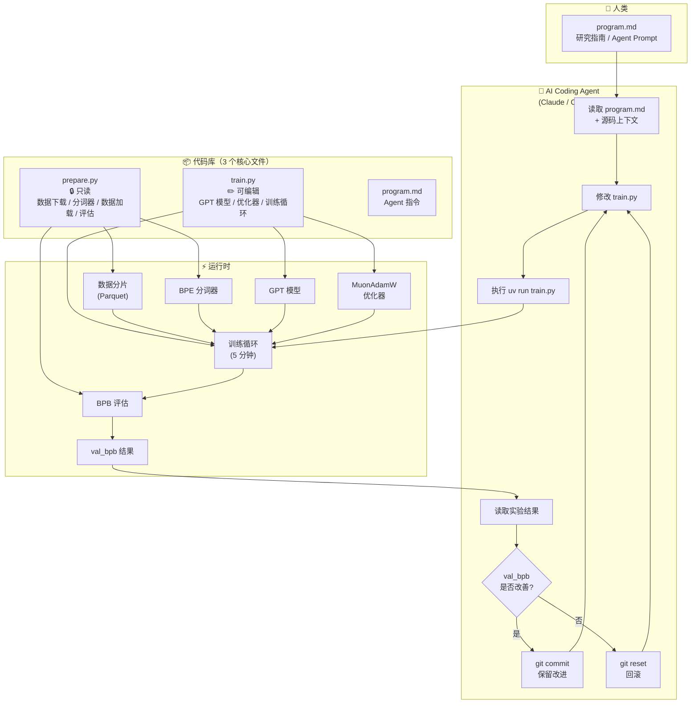
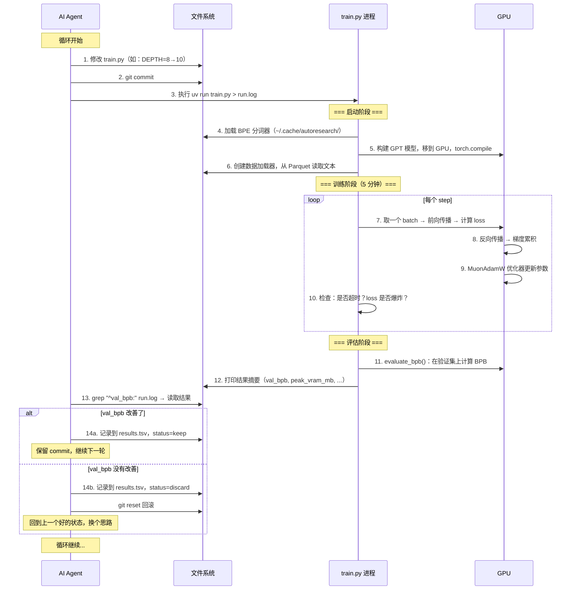

# 第一章 序章：全书地图

## 这本书讲什么

你面前有一个叫 **autoresearch** 的项目。它只有三个文件，加起来不到 1200 行代码，但它要做的事情很有野心：**让 AI agent 自主做深度学习研究**。

具体来说，它搭建了一套迷你但完整的 GPT 语言模型训练环境，然后把"改代码、跑实验、看结果、决定保留还是回滚"这个研究循环交给 AI coding agent（比如 Claude 或 Codex）来自动执行。人类只需要写好一份 Markdown 格式的"研究指南"——`program.md`——然后去睡觉。第二天醒来，agent 已经跑完了上百个实验，留下一份实验日志和一个（希望是）更好的模型。

这本书的目标是：**把这个项目的每一个实现细节讲透**。读完之后，你应该能完全理解从数据准备到模型训练，从优化器设计到 agent 协议的每一个环节。

---

## 项目定位：它解决什么问题

深度学习研究的日常循环是这样的：

```
想一个点子 → 改代码 → 跑实验（等 5 分钟到几天）→ 看结果 → 决定保留或放弃 → 再想一个点子
```

这个循环有两个痛点：一是**等待时间长**（实验跑着的时候研究员通常没法做别的），二是**重复性高**（很多实验就是调个超参数、换个激活函数，本质上是在搜索空间里试探）。

autoresearch 的思路是：**把这个循环完全交给 AI agent**。它做了几个关键的设计决策：

1. **固定 5 分钟时间预算**：不管 agent 怎么改模型大小、batch size、架构，每次实验都跑恰好 5 分钟。这样不同实验的结果就有了统一的比较基准——在相同的时间内，谁的 val_bpb（验证集每字节比特数）更低，谁就更好。
2. **单文件修改约束**：agent 只能修改 `train.py` 这一个文件。数据加载、评估指标都锁死在 `prepare.py` 里不允许动。这确保了实验结果的公正性。
3. **自动 keep/discard**：如果实验改善了 val_bpb，agent 保留这个 commit 继续迭代；否则 git reset 回滚。

---

## 架构全景图



**图解：**

这张全景图展示了 autoresearch 的三层结构：

1. **人类层**：人类的唯一工作是编写 `program.md`——一份给 AI agent 的研究指南。写好之后，人类就可以离开了。

2. **Agent 层**：AI coding agent 读取 `program.md` 和源码，进入一个无限循环——修改 `train.py` → 运行训练 → 检查结果 → 保留或回滚。这个循环一直运行到人类手动停止。

3. **运行时层**：每次 agent 执行 `uv run train.py`，会启动一个完整的训练流程——加载数据、构建模型、训练 5 分钟、评估 val_bpb。这层的所有组件（数据加载器、分词器、模型、优化器、评估函数）就是我们后续章节要逐个拆解的内容。

---

## 核心概念词典

在深入之前，先认识这个项目中最重要的几个概念：

| 概念 | 它是什么 | 在项目中的角色 |
|------|---------|---------------|
| **val_bpb** | Validation Bits Per Byte（验证集每字节比特数）。衡量模型预测文本的好坏——越低，模型越"聪明" | 整个项目唯一的评估指标。Agent 的所有努力都是为了降低这个数字 |
| **BPE** | Byte Pair Encoding（字节对编码）。一种分词算法，把文本切成子词单元 | 文本需要先经过 BPE 分词变成 token 序列，模型才能处理 |
| **GPT** | Generative Pre-trained Transformer。一种自回归语言模型架构——根据前文预测下一个 token | 项目训练的就是一个 GPT 模型，架构定义在 `train.py` |
| **Muon** | 一种专为矩阵参数设计的优化器，通过正交化让梯度更新更高效 | 项目的优化器 MuonAdamW 对不同类型的参数使用不同的优化策略：矩阵参数用 Muon，其余用 AdamW |
| **time budget** | 固定 5 分钟的训练时间预算 | 保证不同实验的公平比较——不管模型多大多小，都只训练 5 分钟 |
| **program.md** | 给 AI agent 的 Markdown 格式研究指南 | 定义了 agent 的行为协议：怎么设置实验、怎么运行、怎么记录、怎么决策 |

---

## 代码库地图

整个项目只有 4 个值得关注的文件：

```
autoresearch/
├── prepare.py      389 行  🔒 只读
│   ├── 常量定义        MAX_SEQ_LEN=2048, TIME_BUDGET=300, VOCAB_SIZE=8192
│   ├── 数据下载        从 HuggingFace 下载 Parquet 数据分片
│   ├── 分词器训练      用 rustbpe 训练 BPE 分词器，保存为 tiktoken 格式
│   ├── Tokenizer 类   运行时分词器封装
│   ├── 数据加载器      make_dataloader() — BOS 对齐 + best-fit packing
│   └── 评估函数        evaluate_bpb() — 计算验证集 BPB
│
├── train.py        630 行  ✏️ Agent 修改的唯一文件
│   ├── GPT 模型        GPTConfig / Attention / MLP / Block / GPT 类
│   ├── 优化器          MuonAdamW — Muon + AdamW 混合优化器
│   ├── 超参数          DEPTH=8, TOTAL_BATCH_SIZE=2^19, 各类学习率
│   ├── 模型构建        build_model_config() → 初始化 → 编译
│   └── 训练循环        while True 循环，5 分钟后停止，评估输出结果
│
├── program.md      114 行  👤 人类编写
│   ├── Setup 协议      分支管理、文件阅读、环境检查
│   ├── 实验规则        什么能改、什么不能改、目标是什么
│   ├── 输出格式        val_bpb 等指标的读取方式
│   ├── 日志格式        results.tsv 的列定义
│   └── 实验循环        永不停止的 keep/discard 循环
│
└── analysis.ipynb  分析笔记本
    └── 可视化实验结果    读取 results.tsv，绘制 BPB 进展图
```

注意一个关键的设计意图：`prepare.py` 定义了**游戏规则**（数据、评估标准），`train.py` 是**游戏内容**（模型和训练策略），`program.md` 是**教练手册**（告诉 agent 怎么玩这个游戏）。Agent 只能在规则框架内修改游戏内容。

---

## 一次典型实验的极简全流程

在深入任何细节之前，先走一遍最粗粒度的全流程。后续每一章都会把这里的某个步骤"放大"讲透。



**逐步解读：**

**步骤 1-3**：Agent 根据自己的"研究直觉"（由 `program.md` 指导）修改 `train.py`。可能是调超参数、改模型架构、换激活函数——什么都可以改。改完后 commit 并运行。

**步骤 4-6**（启动阶段）：`train.py` 启动后，先加载分词器（将文本转为 token 的工具），然后在 GPU 上构建 GPT 模型并用 `torch.compile` 编译优化，最后创建数据加载器准备好训练数据。

**步骤 7-10**（训练阶段，详见第四至六章）：核心训练循环。每个 step 做的事情是：
- 从数据加载器取出一个 batch 的 token 序列
- 模型根据前文预测下一个 token，计算预测误差（loss）
- 反向传播计算梯度
- 优化器根据梯度更新模型参数
- 循环直到 5 分钟时间预算用完

**步骤 11-12**（评估阶段，详见第三章）：训练结束后，在验证集上计算 val_bpb。这个数字就是本次实验的"成绩"。

**步骤 13-14**：Agent 读取结果，做 keep/discard 决策，然后开始下一轮。这个循环可以一直跑下去——Karpathy 在 README 中说，一个晚上可以跑大约 100 个实验。

---

这就是 autoresearch 的全貌。接下来，我们将沿着数据流动的方向，逐层打开每个"黑盒"。下一章会完整追踪一次实验中的数据——从磁盘上的文本文件，到 GPU 上的张量，到最终的 val_bpb 数字——看看数据在每一步是什么形态、经历了什么变换。

---

### 质检报告

**讲解节奏**
- [x] 每个模块先讲"它是什么"再讲"里面有什么"

**周边知识**
- [x] 设计决策处有足够背景（解释了为什么固定时间预算、为什么单文件约束）
- [x] 没有跨度过大的段落

**讲透了吗**
- [x] 全流程每一步解释了数据变化
- [x] 没有跳步
- [x] 复杂节点已标注"详见第 N 章"

**代码纪律**
- [x] 全章代码片段 0 处（仅目录结构示意和流程图）
- [x] 没有超过 5 行的代码块

**流程图准确性**
- [x] 架构全景图经过源码确认（三文件结构、运行时组件均对应实际代码）
- [x] 时序图的步骤顺序与 train.py 实际执行流程一致
- [x] 图下方有逐步文字解释且与图对应

**过渡自然吗**
- [x] 章头直接切入项目是什么
- [x] 章尾引出下一章（数据流全景）
- [x] 章内小节之间有衔接（概念词典→代码地图→全流程）

**准确吗**
- [x] val_bpb、BPE、GPT 等行业标准术语准确
- [x] 项目特有术语（Muon、program.md 协议）已解释
- [x] 无未确认内容

**读得下去吗**
- [x] 术语首次出现有解释
- [x] 每张图有文字讲解
