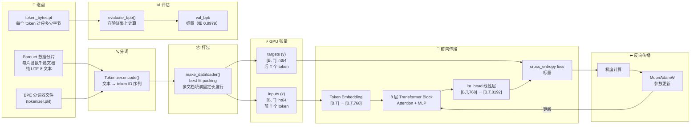
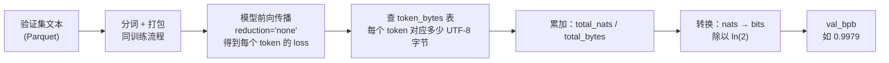

# 第二章 数据流全景：一次实验的完整旅程

上一章我们看到了 autoresearch 的全貌——三个文件、一个循环、一个指标。但一个自然的问题是：**数据在这个系统里到底经历了什么？** 从磁盘上的原始文本到最终输出的 val_bpb 数字，数据在每一步是什么形态、经历了什么变换？

这一章，我们用一次完整的训练实验，追踪数据从头到尾的旅程。每个阶段的内部细节会在后续章节展开，这里先建立全局画面。

---

## 数据旅程全景图



这张图是整个数据旅程的"鸟瞰"。接下来我们逐段走一遍。

---

## 第一段：从文本到 token 序列

**起点：磁盘上的 Parquet 文件**

训练数据存储在 `~/.cache/autoresearch/data/` 目录下，是 HuggingFace 上 `climbmix-400b-shuffle` 数据集的 Parquet 分片。每个分片是一个包含 `text` 列的表格，每行是一篇独立的文档（一段英文文本）。

数据形态：**字符串列表**。比如：`["Hello world! This is a document...", "Another document here..."]`

**第一次变换：BPE 分词**

文本不能直接喂给神经网络——网络只认数字。BPE 分词器把文本拆成"子词"单元，每个单元映射到一个整数 ID。项目的词表大小是 8192（对比 GPT-4 的约 10 万，这是个很小的词表，适合小模型快速实验）。

每篇文档还会在开头插入一个 BOS（Beginning of Sequence）token，标记文档边界。

数据形态变化：

```
"Hello world!"  →  [BOS_ID, 1423, 887, 5012, 33]
                    ↑ 插入 BOS    ↑ "Hel"  ↑ "lo"  ↑ " world"  ↑ "!"
```

变换后：**整数列表的列表**（每篇文档变成一个 token ID 序列，长度不等）。

> 详见第三章"BPE 分词器"一节。

---

## 第二段：从不定长序列到固定形状的 batch

**问题：文档长度参差不齐**

分词后的文档长短不一——有的几十个 token，有的几千个。但 GPU 需要的是**固定形状的矩阵**才能高效计算。怎么把长短不一的文档装进固定大小的矩阵？

**解法：best-fit packing（最佳适配打包）**

`make_dataloader()` 做的事情是：把多篇文档拼接到一个固定长度的"行"里，就像打包行李箱——先找能装下的最大物品塞进去，装不下了就裁剪一篇短文档把剩余空间填满。

每行的长度是 `T + 1 = 2049` 个 token（上下文长度 2048 加一个用于生成 target 的额外位置）。一共有 `B = 128` 行（batch size）。

数据形态变化：

```
doc_A (300 tokens) + doc_B (1200 tokens) + doc_C[裁剪至 549 tokens]
→ 一行 2049 个 token

重复 B=128 次
→ row_buffer: [128, 2049] 的整数矩阵
```

然后，这个矩阵被切分为输入和目标：

```
inputs  = row_buffer[:, :-1]   → [128, 2048]   （前 2048 个 token）
targets = row_buffer[:, 1:]    → [128, 2048]   （后 2048 个 token）
```

这就是经典的**自回归训练**方式：输入是 `[t₀, t₁, ..., t₂₀₄₆]`，目标是 `[t₁, t₂, ..., t₂₀₄₇]`——对于每个位置，模型需要根据前文预测下一个 token。

最后通过 pin_memory + 异步拷贝传输到 GPU。

变换后：**GPU 上的两个 [128, 2048] int64 张量** `(x, y)`。

> 详见第三章"best-fit packing 数据加载器"一节。

---

## 第三段：前向传播——从 token 到预测

数据到了 GPU，接下来是模型处理的核心流程。

**Token Embedding**

`x` 中的每个整数 token ID 查表得到一个 768 维的向量（embedding）。这一步把离散的 token 变成连续的向量空间表示。

```
x: [128, 2048] int64
  → wte(x): [128, 2048, 768] float (bfloat16)
  → RMS Norm
  → 保存为 x0（后续残差连接会用到）
```

**8 层 Transformer Block**

数据依次穿过 8 个 Transformer Block。每个 Block 做两件事：

1. **注意力（Attention）**：每个 token "看" 前面的 token，综合上下文信息。使用了旋转位置编码（RoPE）、QK-Norm、Flash Attention 3 加速，部分层使用滑动窗口限制注意力范围。
2. **MLP**：对每个 token 独立做一次非线性变换，增加模型的表达能力。使用了 ReLU² 激活函数。

在穿过每层之前，还有一个特殊的残差缩放机制——`resid_lambdas` 和 `x0_lambdas` 控制当前隐状态和初始嵌入的混合比例。

```
每一层：x = λ_resid[i] * x + λ_x0[i] * x0
         → Attention(norm(x))  → 残差加回 x
         → MLP(norm(x))        → 残差加回 x
```

数据穿过 8 层后形态不变：`[128, 2048, 768]`。

**LM Head（语言模型头）**

最后一个线性层把 768 维向量映射回词表大小（8192），得到每个位置对下一个 token 的预测概率分布（logits）。

```
x: [128, 2048, 768]
  → RMS Norm
  → lm_head(): [128, 2048, 8192]
  → 转为 float32
  → logit softcap (tanh 缩放，限制极端值)
```

> 详见第四章，完整拆解模型架构。

---

## 第四段：计算 loss 与反向传播

有了模型的预测 logits 和实际的 targets，就可以计算 loss。

**Cross-entropy loss**

对每个位置，比较模型预测的概率分布与实际的下一个 token。差距越大，loss 越高。

```
logits: [128, 2048, 8192]  （模型预测）
targets: [128, 2048]        （实际答案）
→ cross_entropy: 标量       （一个数字，如 3.245）
```

**梯度累积**

一个 optimizer step 需要处理 `TOTAL_BATCH_SIZE = 2^19 ≈ 524K` 个 token。但单次前向传播只处理 `128 × 2048 ≈ 262K` 个 token。所以需要做 `524K / 262K = 2` 次前向+反向传播，累积梯度后再更新参数。

每次反向传播计算出每个参数的梯度（loss 对该参数的偏导数），累积到参数的 `.grad` 属性上。

**参数更新**

累积完梯度后，MuonAdamW 优化器根据梯度更新参数。它对不同类型的参数使用不同的策略：
- 矩阵参数（Attention 和 MLP 中的权重矩阵）→ Muon 优化器（通过正交化提升更新效率）
- 嵌入和标量参数 → AdamW 优化器

> 详见第五章（优化器）和第六章（训练循环）。

---

## 第五段：评估——从 loss 到 val_bpb

训练 5 分钟结束后，在验证集上评估模型表现。

**为什么不直接用 loss？**

Cross-entropy loss 依赖词表大小——词表越大，随机猜测的 loss 越高。如果 agent 改了词表大小，loss 就没法直接比较了。BPB（Bits Per Byte）把 loss 归一化到"每个原始字节"的信息量，不受词表大小影响。

**BPB 计算过程**



逐步说明：
1. 从验证分片加载数据，按训练一样的方式分词和打包
2. 模型前向传播，但用 `reduction='none'` 得到**每个 token 各自的 loss**（而非求平均）
3. 查预先计算好的 `token_bytes` 表——每个 token ID 解码后占多少 UTF-8 字节。特殊 token（字节数为 0）被排除
4. 累加所有 token 的 loss（单位是 nats），累加对应的字节数
5. `total_nats / (ln(2) × total_bytes)` → 得到 bits per byte

评估使用固定数量的 token（`EVAL_TOKENS = 40 × 524288 ≈ 2100 万`），确保不同实验的评估量一致。

> 详见第三章"BPB 评估指标"一节。

---

## 数据形态变化总结

| 阶段 | 数据形态 | 形状 | 所在位置 |
|------|---------|------|---------|
| 原始数据 | UTF-8 字符串 | 不定长 | 磁盘 Parquet |
| 分词后 | token ID 序列 | 不定长整数列表 | CPU 内存 |
| 打包后 | 固定长度矩阵 | [128, 2049] int64 | CPU（pin_memory） |
| 切分后 | 输入 + 目标 | [128, 2048] × 2 | GPU |
| Embedding 后 | 浮点向量 | [128, 2048, 768] bf16 | GPU |
| 8 层 Block 后 | 浮点向量 | [128, 2048, 768] bf16 | GPU |
| LM Head 后 | logits | [128, 2048, 8192] f32 | GPU |
| Loss | 标量 | 1 个浮点数 | GPU |
| 梯度 | 与参数同形 | 各参数对应形状 | GPU |
| val_bpb | 标量 | 1 个浮点数 | CPU |

---

## 本章小结

这一章我们追踪了数据的完整旅程：文本 → token → 固定形状 batch → embedding → 8 层 Transformer → logits → loss → 梯度 → 参数更新 → val_bpb。

这个旅程中有几个关键站点值得深入理解：

- **分词和打包**（第三章）：BPE 分词器怎么训练的？best-fit packing 怎么做到 100% 利用率的？BPB 是怎么精确计算的？
- **GPT 模型**（第四章）：8 层 Transformer Block 里面到底发生了什么？Value Embedding、滑动窗口、ReLU² 各自解决什么问题？
- **优化器**（第五章）：为什么要对矩阵参数特殊对待？Muon 的正交化到底在做什么？

下一章，我们打开第一个黑盒——数据准备与加载。

---

### 质检报告

**讲解节奏**
- [x] 每个模块先讲"它是什么"再讲"里面有什么"

**周边知识**
- [x] 解释了为什么不直接用 loss 而用 BPB
- [x] 解释了自回归训练的 input/target 切分方式
- [x] 没有跨度过大的段落

**讲透了吗**
- [x] 核心流程每一步解释了数据变化（附形状变化表格）
- [x] 没有跳步
- [x] 复杂节点已标注"详见第 N 章"

**代码纪律**
- [x] 全章代码片段 0 处（仅数据形态示意，非代码）
- [x] 没有超过 5 行的代码块

**流程图准确性**
- [x] 数据流全景图的每个节点对应实际代码中的函数/模块
- [x] BPB 计算流程经源码确认（prepare.py evaluate_bpb 函数）
- [x] 图下方有逐步文字解释且与图对应

**过渡自然吗**
- [x] 章头承接上一章的"接下来打开黑盒"
- [x] 章尾引出下一章（数据准备与加载）
- [x] 章内按数据流动顺序自然衔接

**准确吗**
- [x] 张量形状与代码一致（B=128, T=2048, n_embd=768, vocab_size=8192）
- [x] EVAL_TOKENS = 40 × 524288 与代码一致
- [x] grad_accum_steps = 2 的推导正确（TOTAL_BATCH_SIZE / (DEVICE_BATCH_SIZE × MAX_SEQ_LEN)）

**读得下去吗**
- [x] 术语首次出现有解释
- [x] 每张图有文字讲解
