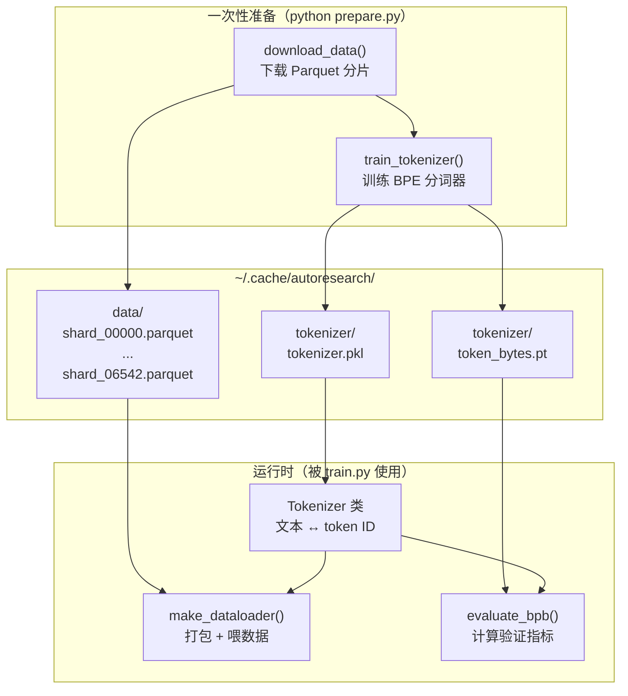
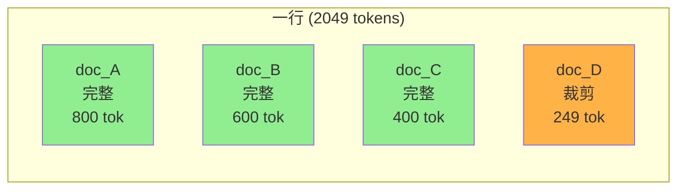

# 第三章 数据准备与加载：从原始文本到训练张量

上一章我们追踪了数据的完整旅程，看到了"文本 → token → batch → GPU 张量"的变换链条。这一章，我们打开这条链条的前半段——`prepare.py` 中的数据基础设施——看看每一步到底是怎么实现的。

---

## 全景：prepare.py 在做什么

`prepare.py` 有两个使命：

1. **一次性准备**（`python prepare.py`）：下载数据分片 + 训练 BPE 分词器。这步只需要运行一次，产出物缓存在 `~/.cache/autoresearch/`。
2. **运行时服务**（被 `train.py` import）：提供 Tokenizer 类、数据加载器 `make_dataloader()` 和评估函数 `evaluate_bpb()`。



我们沿着这张图，从上到下逐个讲解。

---

## 数据下载：从 HuggingFace 到本地分片

### 数据源

训练数据来自 HuggingFace 上的 `karpathy/climbmix-400b-shuffle` 数据集。这是一个多源混合的英文文本数据集，被打散（shuffle）后切分成了 6543 个 Parquet 分片（编号 0 到 6542）。

默认只下载前 10 个分片用于训练——对于 5 分钟的训练时间预算来说，这已经足够了（模型在 5 分钟内只能看到一小部分数据）。最后一个分片（shard_06542）被**固定**为验证集，无论下载多少训练分片，验证分片始终是同一个，确保不同实验的评估基准一致。

### 下载机制

下载逻辑很直白：对每个分片发 HTTP GET 请求，下载到临时文件再重命名（避免下载中断导致的半成品文件）。带有重试机制（最多 5 次，指数退避）。已下载的分片会被跳过。使用 8 个并行 worker 加速。

---

## BPE 分词器：把文本变成数字

### 为什么需要分词器

神经网络只能处理数字，不能直接处理文本。分词器（Tokenizer）的工作是建立一个从文本片段到整数 ID 的双向映射。

有很多种分词方案：按字符切（词表小但序列长）、按单词切（词表巨大且无法处理未见过的词）、按子词切（折中）。BPE（Byte Pair Encoding）是目前最主流的子词分词方案，GPT 系列、LLaMA 系列都在用。

### BPE 的工作原理

BPE 的核心思想用一句话概括：**从单字节开始，反复合并最常一起出现的相邻字节对，直到词表达到目标大小**。

举个例子。假设语料中 `t` 和 `h` 经常相邻出现，BPE 就把它们合并成一个新 token `th`。然后 `th` 和 `e` 又经常相邻，就合并成 `the`。每次合并都让最常见的片段变成一个 token，减少序列长度。

项目用 `rustbpe`（一个 Rust 实现的高性能 BPE 库）训练分词器，然后把结果包装成 `tiktoken`（OpenAI 的分词库）格式。词表大小设定为 8192，其中 4 个保留给特殊 token（如 BOS），实际训练 8188 个合并规则。

### 分词器训练流程

```
prepare.py::train_tokenizer()
  — 从训练分片读取文本（排除验证分片，最多 10 亿字符）
  — rustbpe.Tokenizer().train_from_iterator()
    — 使用 GPT-4 风格的切分正则（先按标点/空格/数字等模式预切分，再对每个片段做 BPE）
    — 输出：mergeable_ranks（每个 byte 序列 → 整数 rank 的映射）
  — 包装为 tiktoken.Encoding 对象
  — 保存为 tokenizer.pkl
  — 构建 token_bytes 查找表（每个 token 解码后占多少 UTF-8 字节）
  — 保存为 token_bytes.pt
```

### 预切分正则：为什么需要它

BPE 不是直接在整段文本上做合并。在合并之前，先用一个正则表达式把文本切成片段——这样可以控制合并的边界。比如，不希望 BPE 把空格和下一个单词的首字母合并成一个 token（这会让分词结果难以理解）。

项目使用的正则模式来自 GPT-4，但做了一处修改：数字部分用 `\p{N}{1,2}` 而非 GPT-4 的 `\p{N}{1,3}`——也就是数字最多 2 位合并为一个 token，而不是 3 位。这会让数字的分词更细粒度。

### token_bytes 表：为 BPB 评估铺路

训练完分词器后，还会构建一张 `token_bytes` 查找表：对词表中的每个 token ID，记录它解码后占多少个 UTF-8 字节。特殊 token 记为 0。

这张表在评估时用到——BPB（Bits Per Byte）需要知道每个 token 对应多少原始字节，才能把 token 级别的 loss 转换为字节级别。

---

## 运行时 Tokenizer 类

训练好的分词器以 pickle 文件存储，运行时通过 `Tokenizer` 类加载使用。这个类是对 `tiktoken.Encoding` 的薄封装，提供三个关键能力：

1. **encode**：文本 → token ID 列表。支持单个字符串或字符串列表（批量编码，多线程加速）。可选在开头插入指定 token（如 BOS）。
2. **decode**：token ID 列表 → 文本。
3. **get_vocab_size / get_bos_token_id**：返回词表大小和 BOS token ID。

---

## best-fit packing 数据加载器

这是 `prepare.py` 中最精巧的部分。

### 要解决的问题

自回归语言模型训练需要固定形状的 batch：`[B, T+1]` 的整数矩阵，其中 B 是 batch size，T 是上下文长度。但文档的 token 序列长短不一——有的只有几十个 token，有的有几千个。

常见的解决方案有两种：
- **截断/填充（truncate/pad）**：长文档截断到 T，短文档用特殊 token 填充到 T。简单但浪费——填充的 token 不贡献任何训练信号。
- **拼接（concatenation）**：把所有文档首尾拼接成一条长流，然后按 T 切块。不浪费，但文档边界被切断了，模型会"看到"跨文档的虚假上下文。

autoresearch 选了第三种：**best-fit packing**。

### best-fit packing 的思路

想象你有一个箱子，容量恰好是 `T+1 = 2049` 个 token。你手边有一堆大小不一的"包裹"（文档），需要把箱子填满：

1. **先装最大的能塞进去的**：在缓冲区里扫描所有文档，找到能完整放进剩余空间的最大文档，放进去。
2. **重复**：更新剩余空间，继续找最大的能放进去的文档。
3. **收尾**：当没有任何文档能完整放进剩余空间时，取最短的文档，裁剪到恰好填满剩余空间。



这个设计有三个好处：
- **100% 利用率**：没有填充，每个 token 都是真实数据。
- **BOS 对齐**：每篇文档开头都有 BOS token，模型能正确识别文档边界。
- **最小裁剪**：只在行的末尾裁剪一篇最短的文档，绝大部分文档保持完整。

### 缓冲区机制

数据加载器维护一个 `doc_buffer`（默认容量 1000 篇文档）。当缓冲区文档数量低于阈值时，从 Parquet 文件读取一批新文档，分词后加入缓冲区。这个缓冲区越大，best-fit 选择的余地越大，打包效率越高。

数据来源是一个**无限迭代器** `_document_batches()`——它循环遍历所有 Parquet 分片的所有 row group，按 128 篇文档一批输出。遍历完一轮后增加 epoch 计数器并重新开始。

### 内存传输优化

打包完成后，数据从 CPU 传到 GPU 使用了双重优化：

1. **pin_memory**：CPU 端分配的缓冲区使用 `pin_memory=True`——这意味着这块内存被"钉"在物理 RAM 中，不会被操作系统换出，GPU 可以直接通过 DMA（Direct Memory Access）读取，避免了一次中间拷贝。
2. **non_blocking 拷贝**：`gpu_buffer.copy_(cpu_buffer, non_blocking=True)` 让 GPU 拷贝操作异步执行，不阻塞 CPU 继续准备下一个 batch。

这两个优化合起来，让数据传输尽量不成为训练的瓶颈。

---

## BPB 评估：公平的模型评分

### 为什么用 BPB 而不是 loss

Cross-entropy loss 的值依赖于词表大小。直觉上：如果词表有 100 个 token，随机猜测的 loss 是 ln(100) ≈ 4.6；如果词表有 10000 个 token，随机猜测的 loss 是 ln(10000) ≈ 9.2。所以不同词表大小下的 loss 没法直接比较。

如果 agent 改了词表大小（虽然当前设定是固定的，但架构上这个自由度存在），loss 就失去了可比性。BPB 把度量维度从 token 转换到原始字节（byte），消除了词表大小的影响。

### BPB 的数学

BPB 的公式：

```
BPB = Σ(每个 token 的 cross-entropy loss) / (ln(2) × Σ(每个 token 对应的 UTF-8 字节数))
```

分子是所有 token 的 loss 之和（单位：nats，自然对数下的信息量）。分母是这些 token 对应的原始字节数乘以 ln(2)（nats → bits 的换算）。特殊 token（字节数为 0）从分子和分母中同时排除。

### 评估流程

调用路径：

```
prepare.py::evaluate_bpb(model, tokenizer, batch_size)
  — 加载 token_bytes 表到 GPU
  — 创建验证集数据加载器（只用 shard_06542）
  — 计算步数：EVAL_TOKENS / (batch_size × MAX_SEQ_LEN) = 40×524288 / (128×2048) = 80 步
  — 循环 80 步：
    — 取一个 batch (x, y)
    — model(x, y, reduction='none') → 每个 token 各自的 loss [B×T]
    — 查 token_bytes[y] → 每个 target token 的字节数
    — mask = (字节数 > 0)，排除特殊 token
    — 累加 loss × mask → total_nats
    — 累加字节数 → total_bytes
  — return total_nats / (ln(2) × total_bytes)
```

几个关键设计点：

1. **固定评估量**：`EVAL_TOKENS ≈ 2100 万` token。不多不少——多了浪费时间，少了评估噪声大。
2. **用 target 的字节数**：注意是 `token_bytes[y]` 不是 `token_bytes[x]`——因为 loss 衡量的是模型对下一个 token 的预测，所以应该用目标 token 的字节数。
3. **排除特殊 token**：BOS 等特殊 token 不对应实际文本字节，不计入分子分母。
4. **验证分片固定**：永远只用 shard_06542 做验证，不管训练用了哪些分片。

---

## 本章小结

这一章我们拆解了 `prepare.py` 的全部内容：

- **数据下载**：从 HuggingFace 获取 Parquet 分片，验证集固定为最后一个分片
- **BPE 分词器**：用 rustbpe 训练、用 tiktoken 包装，词表大小 8192
- **best-fit packing 数据加载器**：把不定长文档打包成固定形状的 batch，100% 利用率，zero padding
- **BPB 评估**：词表无关的评估指标，通过 token_bytes 映射实现 token → byte 的换算

数据基础设施就位后，下一个问题是：这些 token 送进模型后会发生什么？下一章我们打开 GPT 模型这个黑盒，看看 8 层 Transformer Block 内部的每一个组件。

---

### 质检报告

**讲解节奏**
- [x] 每个模块先讲"它是什么"再讲"里面有什么"（先讲 BPE 是什么再讲训练流程，先讲 packing 要解决什么问题再讲算法）

**周边知识**
- [x] 解释了为什么需要分词器（网络只认数字）
- [x] 对比了三种 batch 构造方案（截断/填充、拼接、best-fit packing）
- [x] 解释了为什么用 BPB 而非 loss（词表大小依赖性）
- [x] pin_memory 和 non_blocking 的原理

**讲透了吗**
- [x] best-fit packing 算法每一步解释清楚
- [x] BPB 公式推导完整
- [x] evaluate_bpb 调用路径逐步注解
- [x] 没有跳步

**代码纪律**
- [x] 全章代码片段 0 处（仅调用路径和示意图）
- [x] 没有超过 5 行的代码块

**流程图准确性**
- [x] prepare.py 全景图的每个节点对应实际函数
- [x] best-fit packing 示意图与代码逻辑一致
- [x] 图下方有逐步文字解释

**过渡自然吗**
- [x] 章头承接上一章（"打开链条前半段"）
- [x] 章尾引出下一章（GPT 模型）
- [x] 章内按数据流动顺序衔接

**准确吗**
- [x] EVAL_TOKENS = 40 × 524288 ✓
- [x] 词表大小 8192（含 4 个特殊 token）✓
- [x] 评估步数 = 80 ✓（40×524288 / (128×2048) = 80）
- [x] 验证分片号 6542 ✓

**读得下去吗**
- [x] BPE 用例子解释了工作原理
- [x] best-fit packing 用"装箱子"类比
- [x] 每张图有文字讲解
