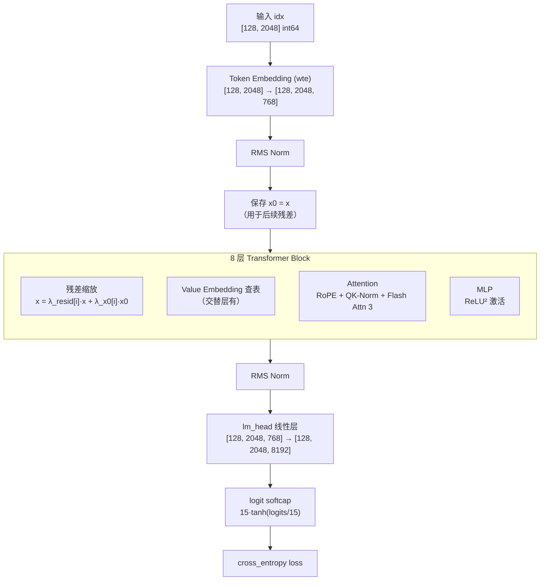
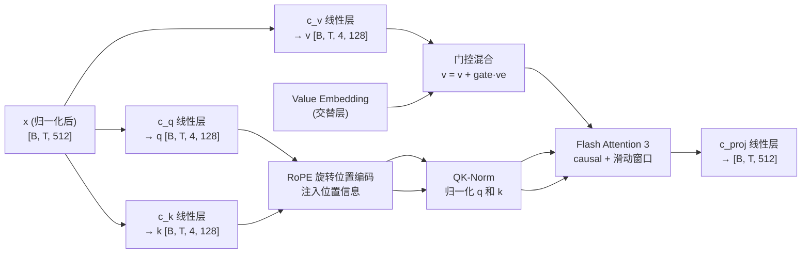

# 第四章 GPT 模型架构：每一层在做什么

上一章我们看到了数据如何从文本变成 GPU 上的整数张量。现在，这些张量要送进模型了。这一章，我们拆开 GPT 模型这个黑盒，逐层看清楚：数据进去是什么形状，出来是什么形状，中间经历了什么变换，**以及为什么要这样设计**。

---

## 模型全景



**整体流程一句话概括**：token ID → 查嵌入表 → 归一化 → 8 层 Transformer Block（每层做注意力+MLP） → 归一化 → 线性映射回词表 → softcap → 计算 loss。

下面我们从头到尾，逐个拆解。

---

## GPTConfig：模型的"基因"

模型的所有结构参数由一个配置类决定。在默认的 DEPTH=8 设定下，`build_model_config()` 计算出的实际配置是：

| 参数 | 值 | 含义 |
|------|-----|------|
| sequence_len | 2048 | 上下文长度 |
| vocab_size | 8192 | 词表大小 |
| n_layer | 8 | Transformer 层数 |
| n_head | 4 | 注意力头数 |
| n_kv_head | 4 | KV 头数（=n_head，即标准多头注意力） |
| n_embd | 512 | 隐藏维度 |
| window_pattern | "SSSL" | 滑动窗口模式 |

隐藏维度的计算逻辑是 `DEPTH × ASPECT_RATIO`（8 × 64 = 512），然后向上取整到 HEAD_DIM=128 的倍数（512 已经是 128 的整数倍）。注意力头数 = n_embd / HEAD_DIM = 512 / 128 = 4。

这是一个很小的模型——大约 5000 万参数——但"五脏俱全"，包含了多项前沿的架构技巧。

---

## Token Embedding + 初始归一化

前向传播的第一步：

```
idx: [128, 2048] int64
→ wte(idx): [128, 2048, 512] bfloat16   （查嵌入表）
→ RMS Norm(x)                            （归一化）
→ 保存为 x0                              （后面残差缩放要用）
```

**RMS Norm（Root Mean Square Normalization）** 是这个项目中唯一使用的归一化方式。它比 LayerNorm 更简单——不减均值，只除以均方根——但在实践中效果几乎一样好，且计算更快。LLaMA、Gemma 等现代模型都转向了 RMS Norm。

为什么要在嵌入之后立刻归一化？因为嵌入向量的初始化是标准正态分布（std=1.0），经过 RMS Norm 后向量被归一化到单位长度附近，让后续层的输入保持稳定的数值范围。

---

## Transformer Block：模型的核心重复单元

8 层 Transformer Block 是模型的主体。每一层做同样的事，但有自己的参数。

### 进入每层前：残差缩放

在进入第 i 层 Block 之前，有一个特殊的操作：

```
x = resid_lambdas[i] × x + x0_lambdas[i] × x0
```

这里 `x` 是当前的隐状态（经过前面若干层处理后的结果），`x0` 是最初的嵌入向量（第 0 层的输出）。`resid_lambdas` 初始化为 1.0，`x0_lambdas` 初始化为 0.1。

**这解决什么问题？**

在深层 Transformer 中，随着层数增加，信息会逐渐"漂移"——越深的层，其输出与原始输入的相关性越弱。`x0_lambdas` 让模型在每一层都可以"回望"最初的 token 嵌入，像一条"高速公路"直连输入和每一层。这个技巧来自 ResFormer 的思路：让模型自己学习在每一层混合"已加工信息"和"原始信息"的比例。

两组标量都是**可学习参数**——模型会在训练中自动调整每层的混合比例。

### Block 内部：注意力 + MLP

每个 Block 的结构是经典的 Pre-Norm 残差连接：

```
x = x + Attention(RMS_Norm(x))
x = x + MLP(RMS_Norm(x))
```

先归一化再送进子层，子层的输出加回原始 x（残差连接）。这个设计在 GPT-2 之后成为标准做法——它让梯度能通过残差连接直达浅层，缓解了深层网络的训练困难。

---

## 注意力机制：每个 token 如何"看"上下文

注意力是 Transformer 的灵魂。它让每个 token 能"看"到前面的所有 token，并从中提取有用的信息。

### 注意力的基本思路

对于序列中的每个位置，注意力做三件事：
1. 生成一个"查询"（Query）：我在找什么信息？
2. 其他位置各生成一个"键"（Key）：我有什么信息？
3. 其他位置各生成一个"值"（Value）：我的具体内容是什么。
4. 用 Query 和 Key 的匹配程度决定从每个位置的 Value 中取多少信息。

### 本项目的注意力实现



让我们逐步走完这个流程。

### Q/K/V 投影

输入 x 通过三个独立的线性层变成 Query、Key、Value。每个被 reshape 成 `[B, T, n_head, head_dim]`，即拆分成多个"头"——每个头独立做注意力。

在默认配置下：n_head=4, head_dim=128, n_kv_head=4。因为 n_kv_head = n_head，这是标准的多头注意力（Multi-Head Attention, MHA）。如果 n_kv_head < n_head，就变成 GQA（Grouped Query Attention）——多个 Query 头共享一组 KV 头，减少内存和计算量。当前配置没有使用 GQA，但架构预留了这个能力。

### Value Embedding（VE）：给 Value 注入 token 信息

这是 autoresearch 架构中一个独特的设计。在**交替层**（由 `has_ve()` 决定：层 1、3、5、7 有 VE），除了从隐状态算出的 v 之外，还会直接从一个**独立的嵌入表**查出一个"Value Embedding"，然后通过一个门控机制混合进 v。

**为什么要这样做？**

标准 Transformer 中，Value 完全由当前层的隐状态决定。但隐状态经过了多层处理，可能丢失了一些原始 token 的信息。Value Embedding 直接从 token ID 查表获得，绕过了所有中间层，让 Value 能获取到"未被加工过的"原始 token 信息。这个思路来自 ResFormer 论文。

**门控机制**：VE 不是直接加到 v 上，而是通过一个输入依赖的门控。门控用 x 的前 32 个通道经过一个小线性层+sigmoid 得到，范围 [0, 2]。初始化时门控权重为 0，sigmoid(0)=0.5，乘以 2 等于 1.0——这意味着初始时 VE 和 v 等权混合，训练中模型自动学习最优比例。

### RoPE：旋转位置编码

Transformer 本身不知道 token 的顺序——给它打乱顺序的输入，输出也一样。需要额外注入位置信息。

RoPE 的做法是：**把 Q 和 K 向量按维度分成成对的组，在每对维度上应用一个与位置相关的旋转**。位置 0 旋转角度为 0，位置 1 旋转一个小角度，位置 2 旋转两倍角度……高频维度旋转快，低频维度旋转慢。

这样做的好处是：两个 token 的 Q·K 点积只取决于它们的**相对距离**（旋转角度之差），而不是绝对位置。这天然支持变长序列——模型在长度 1024 上训练的位置关系知识可以泛化到更长的序列。

项目预计算了 `sequence_len × 10 = 20480` 个位置的旋转矩阵，为可能的长序列预留余量。

### QK-Norm

在 RoPE 之后，对 Q 和 K 各做一次 RMS Norm。

这是一个近年来流行的稳定性技巧。注意力分数 = Q·K / √d，如果 Q 或 K 的数值范围不稳定（某些维度特别大），注意力分数会出现极端值，导致 softmax 饱和。QK-Norm 强制 Q 和 K 的数值范围稳定在单位量级，防止注意力分数"爆炸"。

### Flash Attention 3 + 滑动窗口

Q/K/V 准备好后，送入 Flash Attention 3 计算注意力输出。

Flash Attention 是一种**高效注意力实现**——它不是数学上的改进，而是工程上的优化。标准注意力需要 O(T²) 的中间矩阵，Flash Attention 通过分块计算避免了这个巨大的中间矩阵，大幅节省内存，且在 GPU 上更快（因为减少了 HBM 读写）。

**滑动窗口**是一个注意力范围的限制。全局注意力（L）让每个 token 看完整的前文；滑动窗口注意力（S）只让每个 token 看前 1024 个位置（上下文长度的一半）。

窗口模式 `SSSL` 的含义：按层循环——层 0 用 S，层 1 用 S，层 2 用 S，层 3 用 L，层 4 又回到 S……但最后一层（层 7）**强制使用 L**（全局注意力），确保模型最终输出能看到完整上下文。

**为什么交替使用？** 全局注意力 O(T²) 计算量大，滑动窗口 O(T×W) 计算量小。底层做局部处理（近距离 token 之间的关系），高层做全局整合——用较少的全局注意力层换来与全层全局注意力接近的效果，性价比更高。

### 输出投影

注意力输出 `[B, T, n_head, head_dim]` 拼接回 `[B, T, 512]`，经过 `c_proj` 线性层映射回 512 维，然后通过残差连接加回 x。

---

## MLP：非线性变换

每个 Block 的第二部分是 MLP，结构极简：

```
x → 线性层（512 → 2048，扩展 4 倍）→ ReLU² → 线性层（2048 → 512）
```

**ReLU²（ReGLU 的简化版）**：先 ReLU 把负值归零，再对正值取平方。`F.relu(x).square()` 就是 `max(0, x)²`。

这看起来很简单，但效果优于标准 GELU——ReLU² 激活后，大部分值是 0（稀疏性好），非零值呈平滑增长（平方比线性更强的非线性）。在小模型上，这种简单的高稀疏性激活函数往往表现更好。

注意初始化策略：`c_fc` 使用均匀分布初始化，`c_proj` 初始化为全零。这意味着**训练开始时，MLP 的输出是零**——Block 的输出完全由注意力决定。模型在训练过程中逐渐"启用" MLP，这是一种让初始训练更稳定的技巧。

---

## 输出层：从隐状态到预测

穿过 8 层 Block 后：

```
x: [128, 2048, 512]
→ RMS Norm
→ lm_head (512 → 8192): [128, 2048, 8192]   （logits）
→ 转为 float32
→ softcap: 15 × tanh(logits / 15)
```

**logit softcap** 把 logits 限制在 [-15, 15] 范围内。为什么？极端的 logits 会让 softmax 的梯度几乎为零（饱和），导致那些 token 位置学不到东西。tanh 压缩是一种"软限幅"——在 [-15, 15] 内近似线性，超出范围时被温和地压回来。这个技巧在 Gemma 2 中首次使用。

`lm_head` 的初始化标准差很小（0.001），意味着初始时所有 token 的预测概率接近均匀分布——模型不会在训练开始就过度自信。

---

## 参数初始化策略总结

| 参数类型 | 初始化方式 | 设计意图 |
|---------|-----------|---------|
| wte（token embedding） | 正态分布, std=1.0 | 标准初始化 |
| lm_head（输出映射） | 正态分布, std=0.001 | 初始预测接近均匀 |
| Q/K/V/c_fc 权重 | 均匀分布, ±√3/√n_embd | 输入方差不变 |
| c_proj/MLP c_proj | 全零 | 初始残差=恒等映射 |
| resid_lambdas | 1.0 | 初始保留上一层输出 |
| x0_lambdas | 0.1 | 初始小量混入原始嵌入 |
| VE 嵌入 | 均匀分布 | 同 Q/K/V |
| VE 门控权重 | 全零 | 初始门控=1.0（中性） |

核心理念：**初始时模型行为接近恒等映射**（输入几乎原样穿过所有层），然后在训练中逐渐发展出每层的专属功能。这让训练过程更加稳定。

---

## 同类对比：与 nanoGPT 和 nanochat 的架构选择

autoresearch 的模型脱胎于 nanochat（Karpathy 的另一个项目），而 nanochat 本身是 nanoGPT 的进化版。三者解决的是同一个问题——**在有限计算预算下训练一个尽可能好的小型 GPT 模型**——但架构选择有显著差异。

| 设计点 | nanoGPT | nanochat / autoresearch |
|--------|---------|------------------------|
| 位置编码 | 可学习绝对位置嵌入 | RoPE 旋转位置编码 |
| 归一化 | LayerNorm | RMS Norm |
| 激活函数 | GELU | ReLU² |
| 注意力加速 | PyTorch 内置 SDPA | Flash Attention 3 |
| 注意力窗口 | 全局（全层） | SSSL 交替窗口 |
| Value 分支 | 标准（仅从隐状态计算） | Value Embedding + 门控 |
| 残差连接 | 标准 x + f(x) | 缩放残差 λ·x + λ₀·x₀ |
| 输出限幅 | 无 | logit softcap |
| 参数初始化 | 简单正态 | 零初始化输出投影 + 可学习缩放 |

**差异的根源**在于目标场景的不同：

- **nanoGPT** 的目标是**教学**——用最少的代码展示 GPT 的核心原理，架构选择偏向简单和经典。
- **nanochat / autoresearch** 的目标是**在固定时间预算下极致优化 val_bpb**——所以采用了一切能提升效率的现代技巧。

这些技巧各有代价：RoPE 需要预计算旋转矩阵、Value Embedding 增加了参数量和内存占用、Flash Attention 3 依赖特定硬件。但在 autoresearch 的场景下（单 H100 GPU、5 分钟预算），这些代价完全值得——它们让同样大小的模型在相同时间内达到更低的 val_bpb。

---

## 本章小结

这一章我们拆解了 GPT 模型的每一个组件：

- **Token Embedding + RMS Norm**：把 token ID 变成归一化的向量
- **残差缩放（resid_lambdas + x0_lambdas）**：每层可学习地混合"已加工信息"和"原始嵌入"
- **注意力**：Q/K/V 投影 → Value Embedding 门控混合 → RoPE → QK-Norm → Flash Attention 3（支持滑动窗口）
- **MLP**：ReLU² 激活，高稀疏性
- **输出层**：lm_head + logit softcap
- **初始化策略**：输出投影零初始化，让训练从"接近恒等映射"开始

模型结构理解了，但还有一个关键问题：这些参数是怎么被更新的？为什么矩阵参数要用 Muon 而不是 AdamW？下一章我们进入优化器的世界。

---

### 质检报告

**讲解节奏**
- [x] 每个模块先讲"它是什么"再讲"里面有什么"（注意力先讲基本思路再讲实现细节）

**周边知识**
- [x] RoPE 的工作原理和优势解释充分
- [x] Flash Attention 的定位说明（工程优化而非数学改进）
- [x] 滑动窗口的动机解释
- [x] ReLU² 与 GELU 的对比

**讲透了吗**
- [x] 注意力完整流程（Q/K/V → VE → RoPE → QK-Norm → Flash Attn → 投影）
- [x] 没有跳步
- [x] 初始化策略逐项说明

**代码纪律**
- [x] 全章代码片段 0 处（仅数据形态示意和调用路径）
- [x] 没有超过 5 行的代码块

**同类对比**
- [x] 满足三个前提条件（都是小型 GPT 训练，输入输出一致，架构选择不同）
- [x] 在架构层面展开，没有混层级
- [x] 分析了差异根源（教学 vs 极致优化）

**流程图准确性**
- [x] 模型全景图与 GPT.forward() 一致
- [x] 注意力流程图与 CausalSelfAttention.forward() 一致
- [x] 图下方有逐步文字解释

**过渡自然吗**
- [x] 章头承接上一章（数据送进模型）
- [x] 章尾引出下一章（优化器）
- [x] 章内各组件按前向传播顺序衔接

**准确吗**
- [x] n_embd=512（DEPTH=8 × ASPECT_RATIO=64 = 512）✓
- [x] n_head=4（512/128=4）✓
- [x] has_ve 的交替规则确认（层1,3,5,7）✓
- [x] 窗口模式 SSSL 循环 + 最后一层强制 L ✓
- [x] VE 门控初始值 sigmoid(0)×2=1.0 ✓
- [x] softcap=15 ✓

**读得下去吗**
- [x] 注意力用"查询/键/值"直觉解释
- [x] RoPE 用"旋转角度"直觉解释
- [x] 每张图有文字讲解
