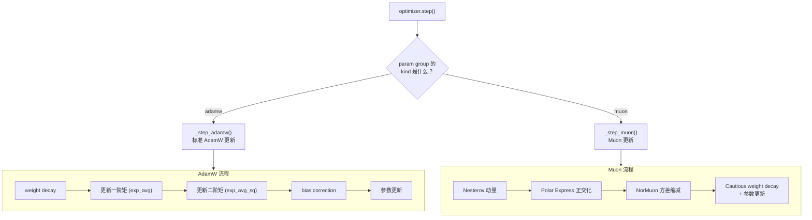

# 第五章 MuonAdamW 优化器：矩阵参数的特殊待遇

上一章我们拆解了模型的前向传播——从 token 到 logits，数据穿过 8 层 Transformer Block。但训练的关键不在于前向传播，而在于**怎么更新参数**。为什么这个项目不用一个简单的 AdamW 了事，而是搞了一个"混合优化器"？矩阵参数为什么要特殊对待？

---

## 先回答"为什么"

### 问题：标准优化器对矩阵参数不够高效

在神经网络中，最多的参数是**矩阵参数**（也叫权重矩阵）——Attention 中的 Q/K/V/Proj、MLP 中的 c_fc/c_proj，这些全是二维矩阵。在 autoresearch 的默认模型中，矩阵参数占了总参数量的大头。

标准的 AdamW 优化器把每个参数**独立对待**——对每个标量参数各自维护一阶矩和二阶矩，逐元素更新。但矩阵参数不是独立的标量集合，它们的行和列之间有**结构关系**。AdamW 完全忽略了这种结构。

**Muon 的核心洞察**：对矩阵参数，与其逐元素更新，不如把梯度矩阵"正交化"——找到与梯度"方向最接近"的正交矩阵作为更新方向。正交更新保持了矩阵的行列结构，实践中能让训练更快收敛。

### 解法：分而治之

autoresearch 的解法很直接——**根据参数类型选择不同的优化策略**：

| 参数类型 | 优化器 | 原因 |
|---------|--------|------|
| Transformer Block 中的权重矩阵（c_q, c_k, c_v, c_proj, c_fc, c_proj） | Muon | 二维矩阵，能利用正交化 |
| token embedding（wte）| AdamW | 嵌入表，不是传统意义的"矩阵运算" |
| value embedding | AdamW | 同上 |
| lm_head | AdamW | 输出映射，学习率需要独立控制 |
| resid_lambdas, x0_lambdas | AdamW | 标量参数，没有矩阵结构 |

---

## MuonAdamW 的整体架构



`MuonAdamW` 继承自 `torch.optim.Optimizer`，在 `step()` 中遍历所有参数组（param group），根据 `kind` 字段分流到不同的更新逻辑。

---

## AdamW 部分：经典自适应学习率

AdamW 是深度学习中使用最广泛的优化器。它的核心思想是：**为每个参数自适应地调整学习率**——梯度大的参数步子小一点，梯度小的参数步子大一点。

流程：
1. **Weight decay**：先把参数向零衰减一小步（`p *= 1 - lr * wd`），这是 L2 正则化的解耦版本
2. **一阶矩**（exp_avg）：梯度的指数移动平均，充当"方向记忆"
3. **二阶矩**（exp_avg_sq）：梯度平方的指数移动平均，充当"步幅调节器"
4. **Bias correction**：修正初始阶段的估计偏差（因为移动平均从零开始）
5. **更新**：`p -= lr * exp_avg / (sqrt(exp_avg_sq) + eps)`

项目对不同类型的 AdamW 参数使用了不同的学习率：

| 参数组 | 学习率 | beta1, beta2 |
|--------|--------|-------------|
| lm_head | 0.004 × scale | (0.8, 0.95) |
| wte embedding | 0.6 × scale | (0.8, 0.95) |
| value embedding | 0.6 × scale | (0.8, 0.95) |
| resid_lambdas | 0.005 | (0.8, 0.95) |
| x0_lambdas | 0.5 | (0.96, 0.95) |

其中 `scale = (model_dim / 768)^(-0.5)`——学习率随模型维度增大而减小，遵循 µP（Maximal Update Parametrization）的思路，让不同大小的模型可以共享超参数。

---

## Muon 部分：矩阵参数的正交化更新

Muon 是 autoresearch 优化器中最独特的部分。它对矩阵参数做了三步处理。

### 第一步：Nesterov 动量

在做正交化之前，先用 Nesterov 动量平滑梯度。普通动量是"带惯性的滑行"——当前更新方向是梯度和历史动量的加权平均。Nesterov 动量更进一步：先"预跳"到动量方向，在那里计算梯度，再决定实际更新方向。实践中收敛更快。

动量系数从 0.85 线性增加到 0.95（前 300 步），然后保持 0.95。

### 第二步：Polar Express 正交化

**这是 Muon 的灵魂。**

核心思想是：给定一个梯度矩阵 G，找到与它"最接近"的正交矩阵 U。数学上这叫**极分解**（polar decomposition）：把矩阵分解为 U·P，其中 U 是正交矩阵，P 是正定对称矩阵。我们只取 U。

**为什么要正交化？**

直觉上，正交矩阵的所有奇异值都是 1——更新方向上的每个"模式"（singular vector）被等权对待。而原始梯度矩阵可能有些奇异值很大、有些很小——大的方向会主导更新，小的方向被淹没。正交化相当于对梯度做了一次"民主化"：所有方向的更新幅度一致，信号不会被噪声淹没。

**怎么计算极分解？**

精确的极分解需要 SVD（奇异值分解），计算量 O(n³)，太贵。Polar Express 用**多项式迭代**近似计算——对矩阵反复做简单的矩阵乘法和加法，每迭代一步，矩阵就更接近正交矩阵。

具体来说，每步迭代形如 `X ← a·X + X·(b·XᵀX + c·(XᵀX)²)`（或者转置版本，取决于矩阵是"高瘦"还是"矮胖"）。系数 a, b, c 是预先优化好的常数（存储在 `polar_express_coeffs` 中），经过 5 步（`ns_steps=5`）迭代后，X 就非常接近正交矩阵了。

**关键实现细节**：
- 迭代前先对梯度做 Frobenius norm 归一化，确保迭代的数值稳定性
- "高瘦"矩阵（行 > 列）走 `XᵀX` 路径，"矮胖"矩阵（行 < 列）走 `XXᵀ` 路径——都选择内积较小的方向计算，节省算力
- 整个计算在 bfloat16 下进行，利用 GPU 的半精度加速

### 第三步：NorMuon 方差缩减

正交化后的梯度，各行/列的方差可能不均匀。NorMuon 是对 Muon 的扩展，通过**二阶矩估计**来标准化每行/每列的更新幅度。

具体流程：
1. 计算正交化梯度的逐行（或逐列）方差
2. 用指数移动平均（beta2=0.95）跟踪这个方差
3. 根据跟踪的方差计算缩放因子——方差大的行/列缩小，方差小的行/列放大
4. 同时保持整体的 Frobenius norm 不变（通过 `v_norm / v_norm_new` 修正）

这个机制类似于 Adam 中的二阶矩自适应——但是在**矩阵的行/列维度**上做，而不是在标量维度上做。它解决了正交化后不同行/列更新幅度不一致的问题。

### 第四步：Cautious weight decay + 参数更新

最后一步有个巧妙的 "cautious" 设计：

标准 weight decay 对所有参数无差别衰减。但如果梯度方向和参数方向相反（梯度说"这个参数应该减小"但 weight decay 也在减小它），那就是双重衰减，力度可能过大。

Cautious weight decay 的做法：只对**梯度方向和参数方向一致**的参数施加衰减。具体通过 `mask = (g * params) >= 0` 实现——只有当梯度和参数同号（都指向"远离零"的方向）时才衰减，避免"矫枉过正"。

---

## 参数分组的工程细节

`setup_optimizer()` 中有一个值得注意的设计：矩阵参数是**按形状分组**的。

```
train.py::GPT.setup_optimizer()
  — 收集所有矩阵参数（transformer.h 的所有参数）
  — 按参数形状（shape）分组
  — 每个形状对应一个 Muon param_group
```

为什么要按形状分组？因为 Muon 的 `_step_muon()` 会把同一组的所有参数 **stack** 成一个三维张量一起处理。只有形状相同的参数才能 stack。这也是一种性能优化——一次矩阵运算处理多个参数，比逐个处理更能利用 GPU 的并行性。

Muon 的学习率还有一个特殊调整：`lr * max(1.0, rows/cols)^0.5`——当矩阵是"高瘦型"时（行多列少），学习率会被放大。这是因为正交化后"高瘦"矩阵的更新幅度天然比"矮胖"矩阵小，需要补偿。

---

## torch.compile 与 0-D tensor 技巧

两个更新函数（`adamw_step_fused` 和 `muon_step_fused`）都被 `@torch.compile(dynamic=False, fullgraph=True)` 装饰——让 PyTorch 将整个函数编译为高效的 GPU kernel。

但有一个问题：`torch.compile` 对 Python 标量参数的变化很敏感——如果学习率从 0.04 变成 0.038，它可能会触发重新编译。项目的解决方案是：把所有标量超参数存储为 **0-D CPU tensor**（如 `self._muon_lr_t`），每步通过 `.fill_()` 更新值。tensor 的**身份**不变（相同的内存地址），只是值变了，这样 `torch.compile` 不会重新编译。

---

## 同类对比：为什么不直接用 AdamW？

autoresearch 面临的优化问题是：**在 5 分钟内让模型参数收敛到尽可能好的状态**。标准 AdamW 和 Muon+AdamW 混合方案解决的是同一个问题，但思路不同。

| 方面 | 标准 AdamW | MuonAdamW（本项目） |
|------|----------|-------------------|
| 梯度处理 | 逐元素一阶矩+二阶矩 | 矩阵参数：正交化 + 行/列级方差缩减；其余：逐元素 |
| 对矩阵结构的利用 | 无——把矩阵展平成向量 | 利用矩阵的行列结构做极分解 |
| 计算开销 | 低（逐元素操作） | 较高（矩阵乘法迭代） |
| 收敛速度（同等 step 数） | 较慢 | 较快（每步更新更有效率） |
| 实现复杂度 | 简单 | 复杂（正交化、方差缩减、分组策略） |

**差异的根源**：AdamW 是一个通用优化器，不假设参数有任何结构。Muon 假设参数是矩阵，并利用矩阵的正交结构来提升更新质量。在 autoresearch 的场景下（时间预算紧、step 数有限），每步更新的"质量"比"简单性"更重要——这就是选择 Muon 的原因。

**代价**：Muon 的正交化迭代需要额外的矩阵乘法。但在 GPU 上，矩阵乘法本身就是最被优化的操作，加上 `torch.compile` 的融合优化，这个额外开销是可以接受的。

---

## 本章小结

这一章我们深入了 MuonAdamW 优化器的内部：

- **分治策略**：矩阵参数用 Muon，非矩阵参数用 AdamW，不同类型参数有不同的最优学习率
- **Muon 的核心**：Nesterov 动量 → Polar Express 正交化（用多项式迭代近似极分解）→ NorMuon 方差缩减 → Cautious weight decay
- **工程优化**：参数按形状分组 stack、0-D tensor 避免 torch.compile 重编译

模型和优化器都明白了，还差最后一个"运行时"组件——训练循环本身。它怎么控制 5 分钟的时间预算？学习率在这 5 分钟内怎么变化？下一章我们来看训练循环和调度策略。

---

### 质检报告

**讲解节奏**
- [x] 先讲"为什么矩阵参数需要特殊对待"再讲 Muon 的实现
- [x] 正交化先讲直觉（民主化方向）再讲实现（Polar Express 迭代）

**周边知识**
- [x] 解释了极分解的数学含义
- [x] 解释了 Nesterov 动量与普通动量的区别
- [x] 解释了 torch.compile 的重编译问题

**讲透了吗**
- [x] Muon 四步流程逐步拆解
- [x] NorMuon 方差缩减流程清晰
- [x] Cautious weight decay 的 mask 逻辑
- [x] 参数分组策略的原因

**代码纪律**
- [x] 全章代码片段 0 处
- [x] 没有超过 5 行的代码块

**同类对比**
- [x] 满足前提条件（都是参数更新，输入输出一致，思路有差异）
- [x] 在优化策略层面展开
- [x] 分析了差异根源（通用 vs 利用矩阵结构）

**流程图准确性**
- [x] MuonAdamW 架构图与 step() 分流逻辑一致
- [x] Muon 四步流程与 muon_step_fused() 一致
- [x] 图下方有逐步文字解释

**过渡自然吗**
- [x] 章头承接上一章（参数怎么更新？）
- [x] 章尾引出下一章（训练循环）
- [x] 章内从"为什么"到"怎么做"到"工程细节"

**准确吗**
- [x] 动量系数 0.85→0.95（300 步）✓
- [x] ns_steps=5 ✓
- [x] beta2=0.95 ✓
- [x] LR scale = (model_dim/768)^(-0.5) ✓
- [x] Muon LR 补偿 max(1, rows/cols)^0.5 ✓

**读得下去吗**
- [x] 正交化用"民主化"直觉解释
- [x] weight decay 用"矫枉过正"解释 cautious 的动机
- [x] 每张图有文字讲解
