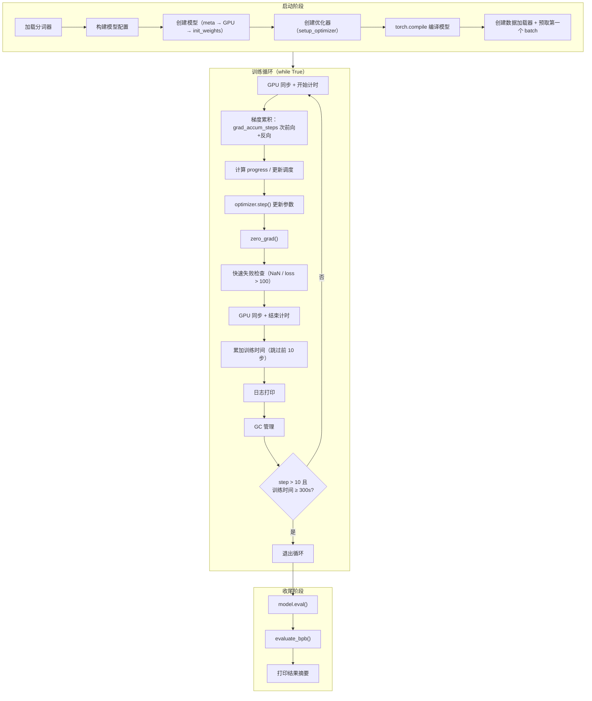
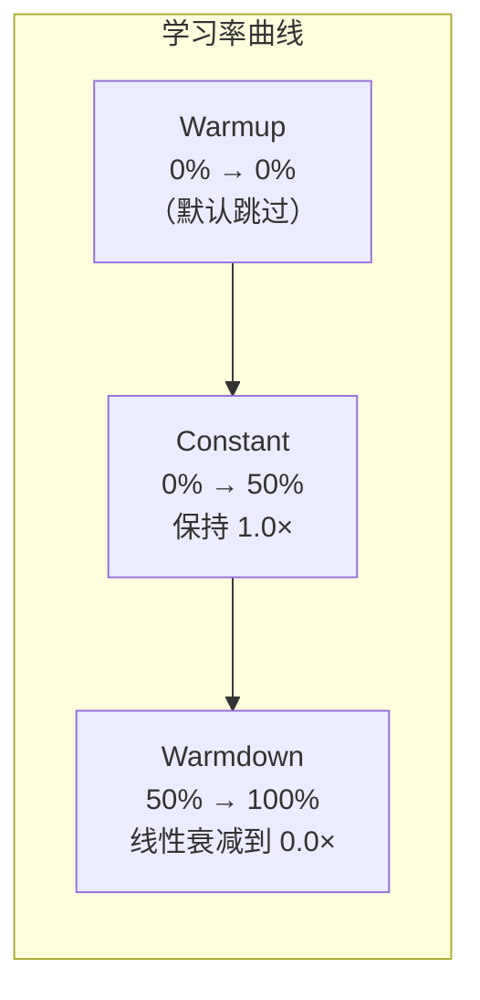

# 第六章 训练循环与调度策略

前面三章我们分别拆解了数据管道、模型架构和优化器。这一章把它们组装起来——看 `train.py` 的"主线程"是怎么驱动一次完整训练的，以及在这 5 分钟里，各种超参数如何随时间变化。

---

## 训练循环全景



---

## 启动阶段：从代码到可训练的状态

训练循环开始之前，有一段初始化序列。这段代码是脚本级的（不在任何函数内），按顺序执行：

```
train.py 启动
  — 设定随机种子 (42)，确保可复现
  — torch.set_float32_matmul_precision("high")
    （允许 TF32 精度的矩阵运算，在精度和速度之间取平衡）
  — 加载分词器
  — build_model_config(DEPTH=8) → GPTConfig
  — 用 meta device 创建模型（不分配实际内存）
  — to_empty(device=cuda)（在 GPU 上分配内存但不初始化）
  — init_weights()（初始化所有参数）
  — setup_optimizer() → MuonAdamW 实例
  — torch.compile(model)（编译为优化的 GPU kernel）
  — make_dataloader() + 预取第一个 batch
```

这里有一个精巧的**延迟初始化**模式：先在 `meta` 设备上创建模型（只记录形状，不分配内存），然后用 `to_empty` 在 GPU 上分配内存，最后手动初始化。这比先在 CPU 创建再整体搬到 GPU 更高效——避免了一次大块内存的 CPU→GPU 拷贝。

**torch.compile** 在首次前向传播时才真正编译——这就是为什么后面要跳过前 10 步的计时。

### 梯度累积的计算

一个 optimizer step 需要的 token 数：`TOTAL_BATCH_SIZE = 2^19 = 524,288`
一次前向传播处理的 token 数：`DEVICE_BATCH_SIZE × MAX_SEQ_LEN = 128 × 2048 = 262,144`
所以需要 `524,288 / 262,144 = 2` 次前向+反向传播才能凑够一个 step 的梯度。

---

## 训练循环的每一步

### 前向 + 反向（梯度累积）

每个 optimizer step 的核心：

```
对 micro_step = 0, 1:
    在 bfloat16 自动混合精度下：
        loss = model(x, y)           // 前向传播
    loss = loss / 2                   // 缩放以匹配累积
    loss.backward()                   // 反向传播，梯度累加到 .grad
    x, y, epoch = next(train_loader)  // 预取下一个 batch
```

**为什么 loss 要除以 grad_accum_steps？** 因为 `.backward()` 是把梯度**累加**到 `.grad` 上的。如果不除，两次累加后的梯度是单 batch 梯度的 2 倍，等价于把学习率翻倍。除以 2 后累加，等价于在完整 batch 上计算的平均梯度。

**bfloat16 自动混合精度**：前向传播在 bfloat16（16 位浮点）下计算——精度略低但速度翻倍、内存减半。梯度计算也在 bfloat16 下，但优化器的状态（一阶矩、二阶矩）保持原始精度。

**预取下一个 batch** 放在 backward() 之后——当 GPU 忙于反向传播时，CPU 可以并行准备下一个 batch 的数据。

### 调度器更新

梯度累积完成后，根据当前训练进度更新三个调度量：

**1. 学习率调度**



- **Warmup**（默认 WARMUP_RATIO=0.0，跳过）：从 0 线性增长到 1.0
- **Constant**（前 50% 训练时间）：保持学习率不变
- **Warmdown**（后 50% 训练时间）：从 1.0 线性衰减到 FINAL_LR_FRAC=0.0

所有参数组共享同一个学习率**乘数** `lrm`——每组的实际学习率 = initial_lr × lrm。

**为什么前半段不衰减？** 在时间预算紧的场景下（只有 5 分钟），希望模型尽快到达一个好的区域。前半段全速探索，后半段慢慢收敛到最优点。

**2. Muon 动量调度**

从 0.85 线性增加到 0.95，在 300 步时达到最大值后保持。初期动量小，模型更多"听从当前梯度"；后期动量大，模型更多"延续之前的方向"。

**3. Weight decay 调度**

从 WEIGHT_DECAY=0.2 线性衰减到 0（随 progress）。训练初期正则化强一些防止过拟合，后期放松让模型自由调整。

### 快速失败检查

```
if isnan(loss) or loss > 100:
    print("FAIL")
    exit(1)
```

这是 autoresearch 场景下的重要安全网。Agent 可能做出激进的修改导致训练不稳定——loss 变成 NaN 或爆炸到很大的值。与其浪费 5 分钟等训练跑完再发现失败，不如立刻终止，让 agent 可以快速尝试下一个想法。

### 时间计量的精巧设计

```
if step > 10:
    total_training_time += dt
```

**前 10 步不计入训练时间。** 为什么？因为前几步包含了 `torch.compile` 的编译开销——编译可能需要几十秒，这不是"训练"时间。通过跳过前 10 步，`total_training_time` 精确反映的是纯训练时间（前向+反向+优化器更新）。

同理，退出条件也要求 `step > 10`——防止在编译阶段就因为"时间到了"而退出。

### GC 管理：避免 Python 垃圾回收的卡顿

```
step 0: gc.collect() + gc.freeze() + gc.disable()
每 5000 步: gc.collect()
```

Python 的垃圾回收器会定期扫描所有对象检查循环引用，在有大量 tensor 的场景下，一次 GC 可能导致 ~500ms 的卡顿。

项目的策略是：在第 0 步做一次完整的 GC，然后**冻结所有当前存活的对象**（`gc.freeze()`——告诉 GC 这些对象是长期存活的，不需要每次检查）并**关闭自动 GC**（`gc.disable()`）。之后每 5000 步手动收集一次，把积累的垃圾清理掉。

这个优化在 5 分钟的紧凑训练中很有意义——避免了不可预测的 GC 停顿，让每步的时间更稳定。

---

## 收尾阶段：评估与输出

训练时间用完后，退出循环，进入评估：

```
train.py 收尾
  — model.eval()（关闭 dropout 等训练专用行为——本模型实际没有 dropout，但这是好习惯）
  — evaluate_bpb()（详见第三章）→ val_bpb
  — 计算各种统计量
  — 打印格式化的结果摘要
```

输出摘要包含以下关键指标：

| 指标 | 含义 | 典型值 |
|------|------|--------|
| val_bpb | 验证集 BPB（核心指标） | ~0.998 |
| training_seconds | 纯训练时间 | ~300.1 |
| total_seconds | 总时间（含启动+评估） | ~325.9 |
| peak_vram_mb | GPU 内存峰值（MB） | ~45060 |
| mfu_percent | 模型算力利用率 | ~39.8% |
| total_tokens_M | 训练的总 token 数（百万） | ~499.6 |
| num_steps | 总步数 | ~953 |
| num_params_M | 参数量（百万） | ~50.3 |
| depth | 层数 | 8 |

**MFU（Model FLOPs Utilization）** 衡量实际算力利用率——理论上 H100 在 bfloat16 下有 989.5 TFLOPS，实际能用到多少。MFU ~40% 对单 GPU 训练来说是不错的数字（完美的 100% 几乎不可能达到，因为有内存带宽瓶颈和各种开销）。

---

## 超参数全景

最后，把所有超参数汇总，让读者对"可调的旋钮"有完整的认知：

| 类别 | 参数 | 默认值 | 作用 |
|------|------|--------|------|
| 架构 | DEPTH | 8 | 层数，决定模型大小 |
| 架构 | ASPECT_RATIO | 64 | 宽度 = DEPTH × ASPECT_RATIO |
| 架构 | HEAD_DIM | 128 | 每个注意力头的维度 |
| 架构 | WINDOW_PATTERN | "SSSL" | 滑动窗口模式 |
| 优化 | TOTAL_BATCH_SIZE | 2^19 | 每步的总 token 数 |
| 优化 | DEVICE_BATCH_SIZE | 128 | 单次前向的 batch size |
| 优化 | MATRIX_LR | 0.04 | Muon 学习率 |
| 优化 | EMBEDDING_LR | 0.6 | 嵌入学习率 |
| 优化 | UNEMBEDDING_LR | 0.004 | 输出映射学习率 |
| 优化 | SCALAR_LR | 0.5 | 标量参数学习率 |
| 优化 | WEIGHT_DECAY | 0.2 | Muon weight decay |
| 调度 | WARMUP_RATIO | 0.0 | 学习率预热比例 |
| 调度 | WARMDOWN_RATIO | 0.5 | 学习率冷却比例 |
| 调度 | FINAL_LR_FRAC | 0.0 | 最终学习率比例 |

**这些就是 agent 的"搜索空间"**——它可以改动这里的任何一个值，也可以改动模型和优化器的代码本身。program.md 中的"Everything is fair game"指的就是 `train.py` 中的一切。

---

## 本章小结

这一章我们走完了训练循环的每一个细节：

- **启动阶段**：延迟初始化（meta → GPU）、torch.compile、数据预取
- **训练循环**：梯度累积、三个调度器（LR / 动量 / weight decay）、快速失败、前 10 步不计时
- **收尾阶段**：evaluate_bpb、打印结果摘要
- **GC 优化**：冻结 + 禁用自动 GC，每 5000 步手动收集

到这里，我们已经完整理解了 autoresearch 的整个技术栈——数据（第三章）、模型（第四章）、优化器（第五章）、训练循环（本章）。

但还有一个维度我们没有触及：**agent 的行为逻辑**。`program.md` 是怎么指导 agent 工作的？它作为一个 prompt 有什么设计巧思？下一章我们从 agent 协议和 prompt 设计的角度来分析。

---

### 质检报告

**讲解节奏**
- [x] 每个机制先讲"为什么"再讲"怎么做"（如跳过前 10 步的原因在时间计量处解释）

**周边知识**
- [x] 解释了梯度累积为什么要除以 step 数
- [x] 解释了 bfloat16 混合精度的作用
- [x] 解释了 MFU 的含义
- [x] 解释了 GC freeze 的原理

**讲透了吗**
- [x] 训练循环每一步都有解释
- [x] 三个调度器的变化规律说明清楚
- [x] 没有跳步

**代码纪律**
- [x] 全章代码片段 0 处（仅调用路径和流程图）
- [x] 没有超过 5 行的代码块

**流程图准确性**
- [x] 训练循环全景图与 while True 循环逐行对应
- [x] 学习率曲线与 get_lr_multiplier() 一致
- [x] 图下方有逐步文字解释

**过渡自然吗**
- [x] 章头承接前三章（组装起来）
- [x] 章尾引出下一章（agent 协议）
- [x] 章内按执行顺序衔接

**准确吗**
- [x] grad_accum_steps = 2 ✓
- [x] 前 10 步不计时 ✓
- [x] GC 策略（step 0 freeze + disable，5000 步 collect）✓
- [x] H100_BF16_PEAK_FLOPS = 989.5e12 ✓
- [x] WARMDOWN_RATIO = 0.5 ✓

**读得下去吗**
- [x] 术语首次出现有解释（MFU、meta device、梯度累积）
- [x] 每张图有文字讲解
