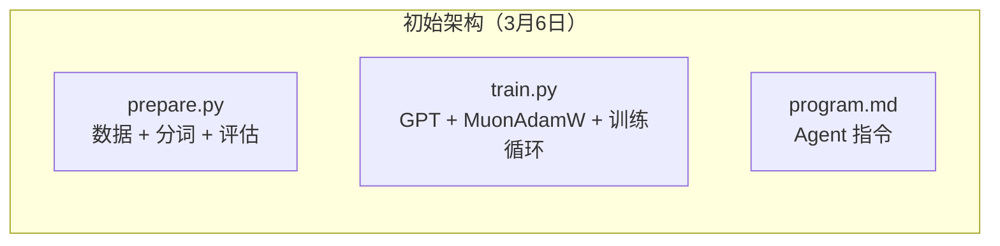
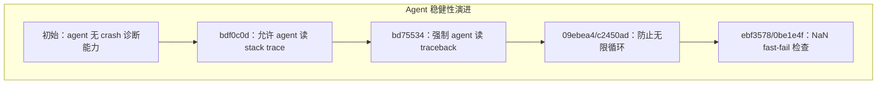
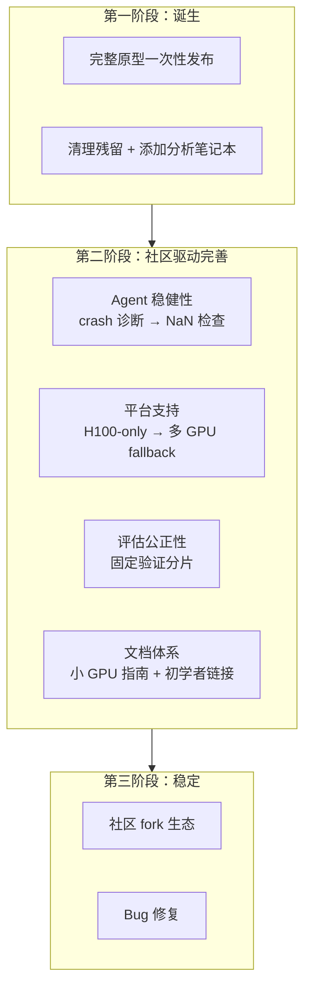

# 第八章 项目演进史：从初始提交到当前形态

前面七章我们分析了 autoresearch 的当前形态——它的每个组件为什么存在、怎么工作。但一个项目不是一夜之间变成这样的。这一章，我们通过 commit 历史回溯项目的演进过程，看看它是怎么从一个简单的想法"长"成现在这个样子的。

autoresearch 的 commit 历史不长——35 个 commit，跨度约三周（2026 年 3 月 6 日至 3 月 26 日）。我们按时间线分为三个阶段。

---

## 第一阶段：诞生（3 月 6 日）

### 初始提交

**commit b11d6f2** — "initial commit"（2026-03-06）

项目以一个完整的、可工作的形态一次性发布。不像很多开源项目是从骨架逐步搭建的，autoresearch 的初始 commit 就包含了所有核心文件：`prepare.py`、`train.py`、`program.md`、`pyproject.toml`、`README.md`。

这说明 Karpathy 在公开发布前已经在本地完成了整个系统的开发和测试。发布时是一个**成熟的原型**，不是一个 WIP（work in progress）。

### 快速迭代（同日）

接下来几个小时内，连续发布了几个 commit：

- **2a70301** — "small tweak readme"
- **1e207aa** — "erase experimental file from before that snuck through in my purge"
- **4ab35a9** — "also ref twitter"（添加 Twitter 链接）
- **ae81d55** — "remove spawn.sh reference from README"
- **69eb7f9** — "cleanup more references to spawn.sh"
- **9c383a8** — "add analysis notebook for convenience"

这些 commit 揭示了几个有趣的细节：

1. **spawn.sh 的痕迹**：原本存在一个 `spawn.sh` 脚本（可能用于批量启动 agent），在发布前被删除但残留了引用。这暗示 Karpathy 最初的设想可能包含多 agent 编排，后来简化为单 agent 设计。
2. **分析笔记本**是在初始 commit 之后才添加的——说明可视化不是 MVP 的一部分，但很快被认为是必要的。

---

## 第二阶段：社区反馈驱动的完善（3 月 7 日 — 3 月 11 日）

项目发布后获得了大量关注（Karpathy 的影响力），社区反馈快速涌入。这个阶段的 commit 主要是完善 agent 的稳健性和扩大平台支持。

### Agent 稳健性增强

逐步分析：

**commit bdf0c0d**（3月7日）— "Allow agent to diagnose crashes by reading the python stack trace"

初始版本中，如果训练崩溃了，agent 不知道为什么。这个 commit 在 program.md 中添加了 `tail -n 50 run.log` 的指示——让 agent 能读取 Python 的错误信息。

**commit bd75534**（同日）— "Fix agent crash blindspot by forcing it to read traceback"

前一个 commit 只是"允许"agent 读错误信息，但 agent 可能不主动这样做。这个 commit 把它从"可选"变成了实验循环中的**必选步骤**——如果 grep 输出为空，就必须执行 tail 命令。

这是一个典型的"从人类经验到 prompt 改进"的过程：Karpathy 观察到 agent 在遇到 crash 时行为不佳（可能反复重试同样的错误），于是通过修改 prompt 来纠正行为。

**commit 09ebea4 / c2450ad**（3月11日）— "Guard against infinite loop when no training shards exist"

发现了一个边界情况：如果数据没准备好，数据加载器会进入无限循环。这个 commit 添加了 assert 防止这种情况。

**commit ebf3578 / 0be1e4f**（3月9-11日）— "fix NaN loss not caught by fast-fail check"

训练中 loss 变成 NaN 时，原来的快速失败检查没有正确捕获。这是 agent 在实际运行中暴露的 bug——如果 agent 做了一个导致 NaN 的修改，训练会继续跑完 5 分钟再报告失败，浪费时间。修复后，NaN 立刻触发退出。

### 平台支持扩展

**commit bb54287 / 17b480a**（3月7日）— "add fallback FA3 kernel for non-Hopper GPUs"

原始版本只支持 H100（Hopper 架构）的 Flash Attention 3。社区成员 marcinbogdanski 提交 PR，添加了非 Hopper GPU 的 fallback。这是项目的第一个外部贡献。

之后，多个社区 fork 被添加到 README：MacOS 版（miolini）、MLX 版（trevin-creator）、Windows/RTX 版（jsegov）、AMD 版（andyluo7）。

### 文档完善

这个阶段有大量文档 commit：

- **6fdefa7** — 让 agent 也读 README（更多上下文）
- **8a5c486** — 一批文档小改 + 添加了 progress.png
- **032d203** — 固定验证分片编号（pin val shard）
- **47ec1ad** — 完善人类和 agent 的文档
- **c92bee5** — 为小 GPU 用户添加调参指南
- **068d93d** — 明确 results.tsv 不应 commit
- **c12eef7** — 添加初学者指南链接

**固定验证分片**（032d203）是一个重要的设计决策变更：在此之前，验证分片可能不固定，不同实验可能用不同的验证数据，导致 val_bpb 不完全可比。固定后，所有实验共享同一个验证分片，评估结果完全可比。

---

## 第三阶段：稳定与社区维护（3 月 16 日 — 3 月 26 日）

### 社区贡献

**commit 32a1460 / 513fe6f**（3月16日）— 添加 AMD ROCm fork 到 notable forks

**commit f32ab04**（3月19日）— "fix(analysis): define best_bpb before y-axis scaling"

分析笔记本中的一个 bug 修复——best_bpb 变量在使用前未定义。这是社区贡献者 kaizen-38 的 PR。

**commit e6d79c1**（3月20日）— "Enhance README with more project context and links"

更丰富的项目说明。

---

## 演进脉络总结

**几个关键趋势：**

1. **设计思路从"能跑"到"稳健"**：初始版本假设理想条件（H100 GPU、数据已准备、训练不崩溃），后续 commit 逐步处理各种边界情况（NaN、OOM、数据缺失、非 Hopper GPU）。

2. **Prompt 随实战进化**：`program.md` 的修改反映了 Karpathy 观察 agent 实际行为后的调整——特别是 crash 处理和永不停止指令的增强。

3. **社区驱动的平台扩展**：核心设计保持不变，但支持的硬件平台从单一 H100 扩展到了 MacOS/Windows/AMD 等多种平台（通过 fork 生态而非主仓修改）。

4. **评估标准逐步严格化**：固定验证分片、不 commit results.tsv、明确 fast-fail 规则——每个改动都是在让实验结果更可信、更可比。

---

## 本章小结

通过 35 个 commit 的回溯，我们看到了 autoresearch 从一个完整原型发展到稳定版本的过程：

- **初始发布**就是成熟原型，三文件架构从始至终不变
- **Agent 稳健性**是最大的改进方向：crash 诊断、NaN 检查、无限循环防护
- **评估公正性**持续增强：固定验证分片、统一评估标准
- **社区生态**通过 fork 而非主仓扩展平台支持

最后一章，我们将用一次完整的端到端追踪来串联全书——从 agent 打开 program.md 的那一刻开始，到 val_bpb 数字出现在屏幕上结束。

---

### 质检报告

**讲解节奏**
- [x] 按时间线分阶段，每阶段有当时的架构状态

**周边知识**
- [x] 解释了固定验证分片的意义
- [x] 解释了 fast-fail 修复的动机

**讲透了吗**
- [x] 关键 commit 逐个分析了动机和影响
- [x] Agent 稳健性演进链完整
- [x] 没有跳步

**代码纪律**
- [x] 全章代码片段 0 处
- [x] 没有超过 5 行的代码块

**流程图准确性**
- [x] 演进图的每个节点对应实际 commit
- [x] 时间线顺序正确
- [x] 图下方有逐步文字解释

**过渡自然吗**
- [x] 章头承接上一章（了解当前形态后回看演进）
- [x] 章尾引出下一章（端到端追踪）
- [x] 章内按时间线自然衔接

**准确吗**
- [x] commit hash 与 GitHub 记录一致
- [x] commit 日期正确
- [x] commit 消息准确引用

**读得下去吗**
- [x] 每个 commit 不只列出消息，还分析了动机
- [x] spawn.sh 的"考古发现"增加可读性
- [x] 每张图有文字讲解
